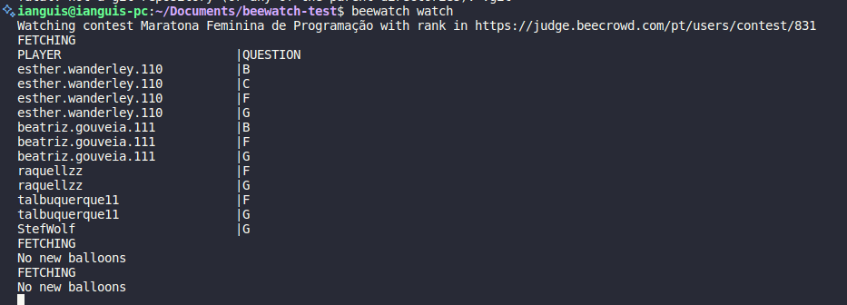

# Beecrowd contest watcher

A CLI tool to track beecrowd contest rank changes and help local staff to deliver :balloon: 's

## Installation
Clone the repository, and on the root dir execute:
```bash
npm install -g .
```

## Usage
### Setting up

```bash
beewatch init
```

You will receive a prompt to configure contest name and url. The name can be whatever you want, but URL field should be the URL of the rank you want to track. Example: `https://judge.beecrowd.com/pt/users/contest/831/`. This will create a file `contestInfo.json` on your working directory.

### Adding players to track

```bash
beewatch add <playerName>
```
To track a single username.

```bash
beewatch add --file <filePath>
```
To track all the users in the file.

```bash
beewatch add-all
```
To track all the players current registered in the contest.

### Remove players from tracking

```bash
beewatch remove <playerName>
```

### Track changes

Run the following command at the same directory of your `contestInfo.json` file
```bash
beewatch watch
```

The command will warn you when there are new :balloon: 's to deliver

### Output example
